<pre>
▌ ▌▗    ▜▘▝▌    ▀▀▌               
▙▄▌▄    ▐ ▝▛▚▀▖  ▞ ▞▀▖▌ ▌▛▀▖▞▀▖▛▀▖
▌ ▌▐ ▗▖ ▐  ▌▐ ▌ ▞  ▛▀ ▚▄▌▌ ▌▛▀ ▙▄▘
▘ ▘▀▘▗▘ ▀▘ ▘▝ ▘ ▀▀▘▝▀▘▗▄▘▘ ▘▝▀▘▌  
</pre>
I’m an iOS developer based in Istanbul, Turkey. I’m currently studying Software Engineering as a third-year student. Alongside my academic journey, I focus on building projects and improving my skills in mobile app development.
```bash
npx zeynep # Run this in your terminal and let the magic happen 
```

## About Me  
| - My Website : www.zeynepmuslim.com <br> - My Blog : [www.zeynepmuslim.blog](http://www.zeynepmuslim.blog) <br><br> [](https://www.linkedin.com/in/zeynep-m%C3%BCslim/) [](https://mastodon.social/@zeynepmuslim) [](https://x.com/zeynepmuslim) | 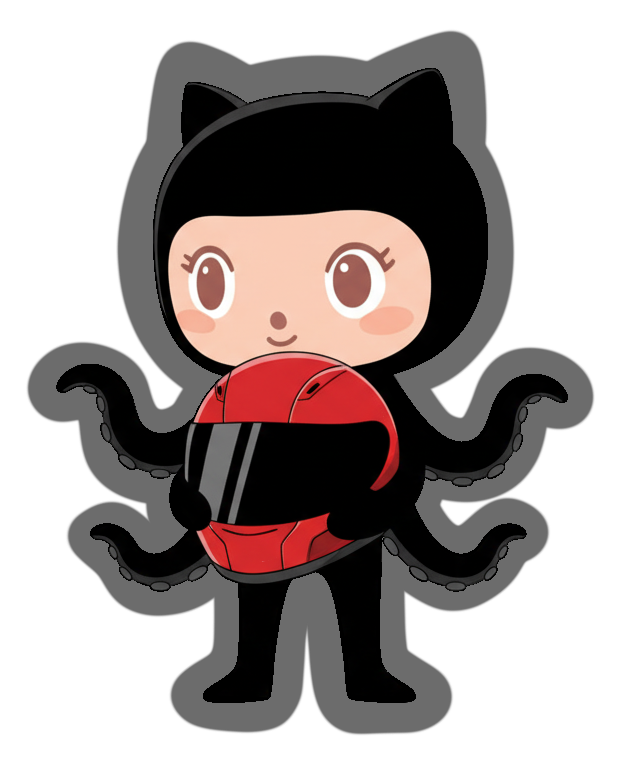 |
| :--- | --- |

## My Tool Kit
| For Building Cool Stuff | For Making It Beautiful |
| --- | --- |
| &nbsp;&nbsp;&nbsp;&nbsp; | &nbsp;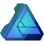&nbsp;&nbsp;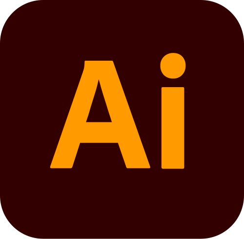&nbsp;&nbsp;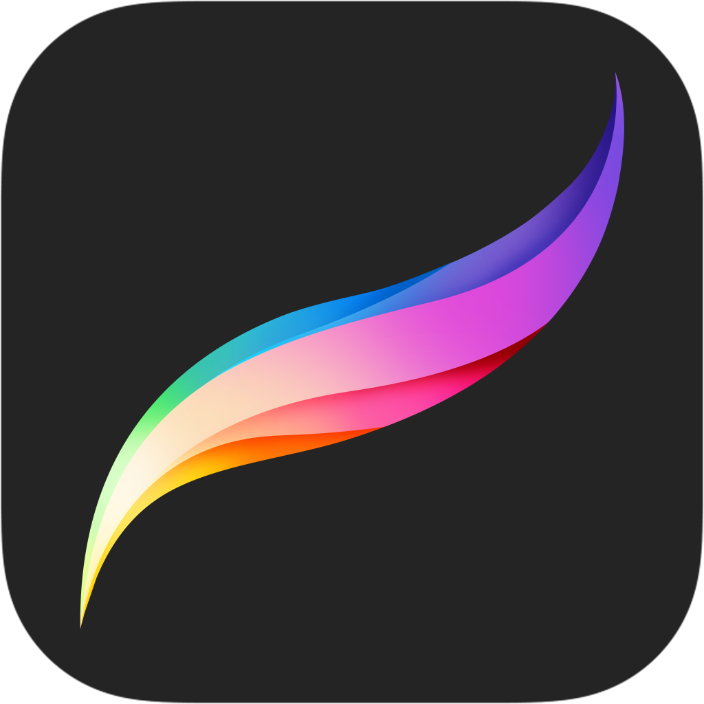&nbsp;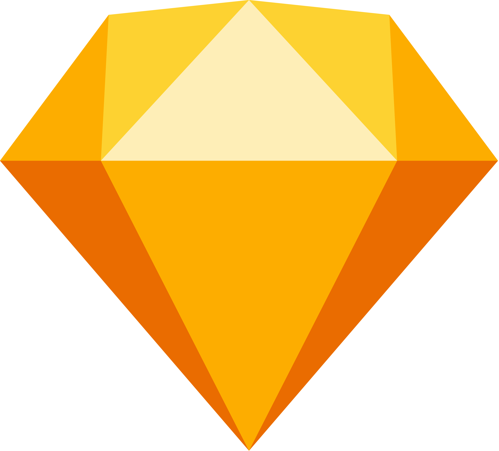&nbsp; |

## Projects

|**App Store** | [<div align="center"><br><b>Purgio</b></div>](https://apps.apple.com/tr/app/purgio/id6762494793) | [<div align="center"><br><b>Spy</b></div>](https://apps.apple.com/us/app/spy-the-game/id6748213306) | [<div align="center">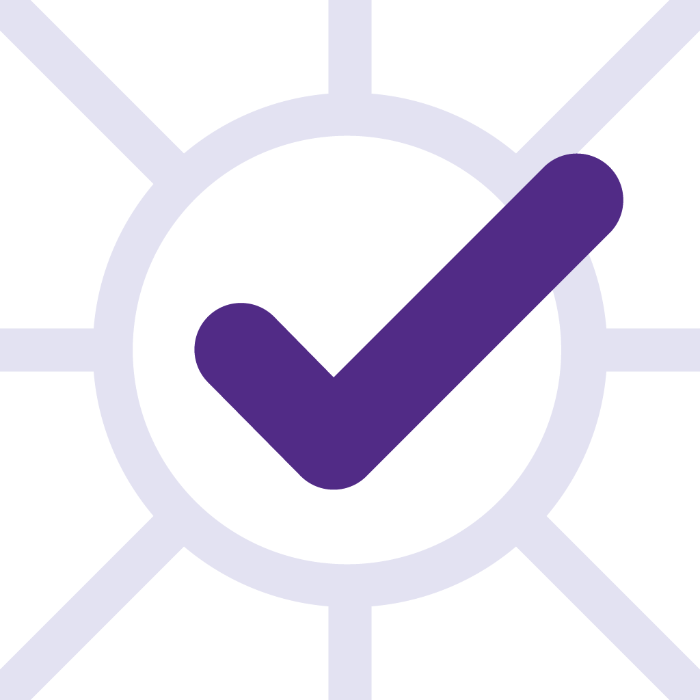<br><b>TaskHub</b></div>](https://apps.apple.com/us/app/taskhub/id6739947000) | [<div align="center">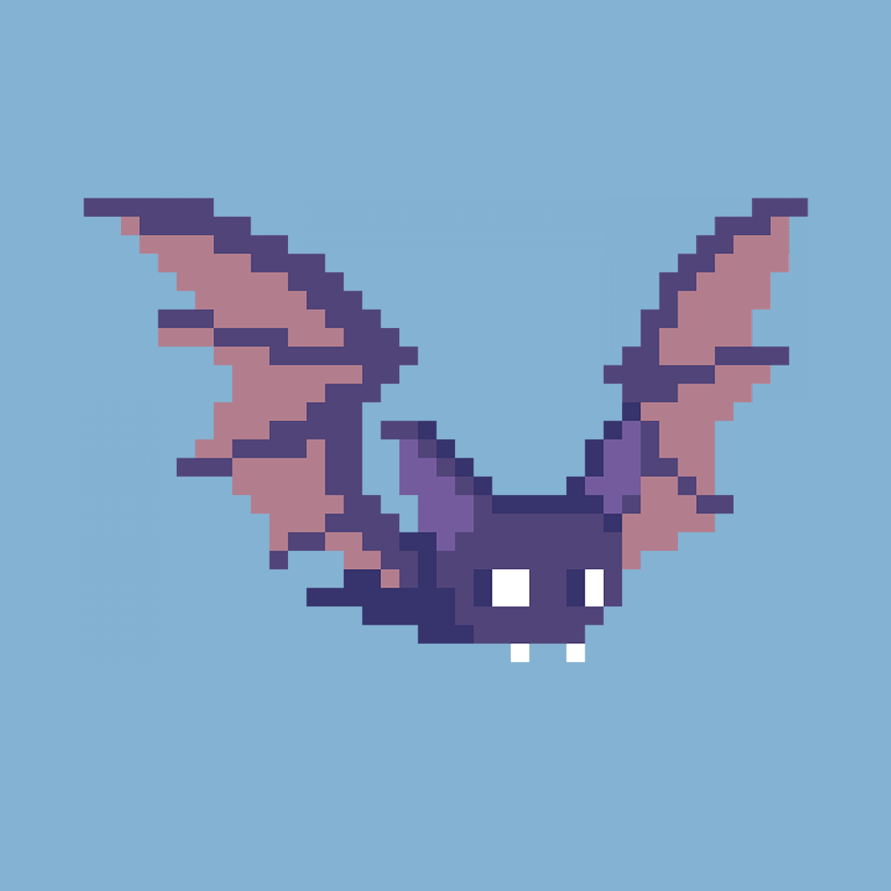<br><b>Tap and Rise</b></div>](https://apps.apple.com/us/app/tap-and-rise/id1547185387) | [<div align="center">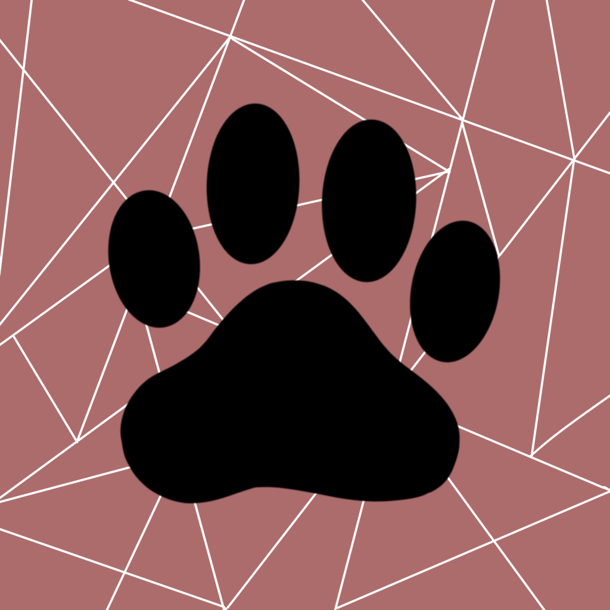<br><b>Catch Game For Cats</b></div>](https://apps.apple.com/us/app/catch-game-for-cats/id1560331647) | [<div align="center">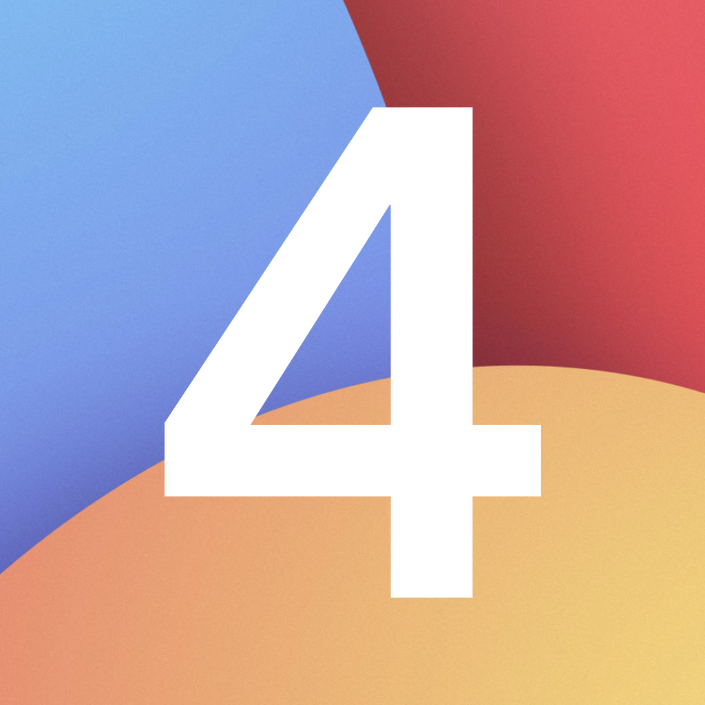<br><b>4 İşlem Oyunu</b></div>](https://apps.apple.com/us/app/4-i-şlem-oyunu/id1528334211) |
|---|---|---|---|---|---|---|
| **GitHub** | <div align="center">[](https://github.com/zeynepmuslim/secure-photo-cleaner-app)</div> | <div align="center">[](https://github.com/zeynepmuslim/SPY)</div> | <div align="center">[](https://github.com/zeynepmuslim/to-do-list)</div> | <div align="center">[](https://github.com/zeynepmuslim/Tap-and-Rise)</div> | <div align="center"><a href="https://apps.apple.com/tr/app/catch-game-for-cats/id1560331647?l=tr"></a><a href="https://www.youtube.com/watch?v=BXSjI45fGPI&t=451s"></a></div> | <div align="center">[](https://github.com/zeynepmuslim/4-islem-oyunu)</div> |

- [**Draggable Ball: a UIKit component** ](https://github.com/zeynepmuslim/draggable-ball)
- **Legacy Website:** www.old.zeynepmuslim.com(2021) - [the repo](https://github.com/zeynepmuslim/portfolio)

## My Tools

- 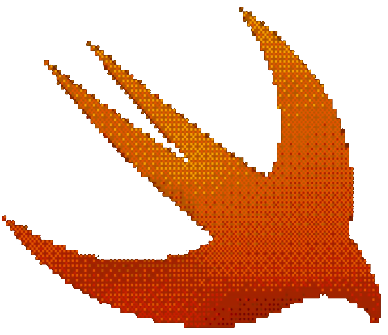 [**Swift Paths**](https://swift-paths.com)  
  *Convert SVGs to Swift Paths in seconds.*  
  Paste your SVG, copy the Swift code. Ready to use and animate. No payment, no apps, no accounts.  
  SVG -> SwiftUI Path | UIBezierPath | CGPath
  <br clear="left"/>

## ✒️ Selected writing

- [*How to Code a Rolling Ball with Swift*](http://zeynepmuslim.blog/post.html?post=draggable-ball-eng%2Fdraggable-ball-eng.md)

<div style="display: flex; align-items: flex-start; justify-content: space-between;">

  <div style="flex: 1; padding-right: 20px;">
    <h2>👀 Fun Fact</h2>
    <p>
      Also (if you still haven’t figured it out), I absolutely love riding motorcycles.
    </p>
  </div>

  <div style="flex-shrink: 0;">
    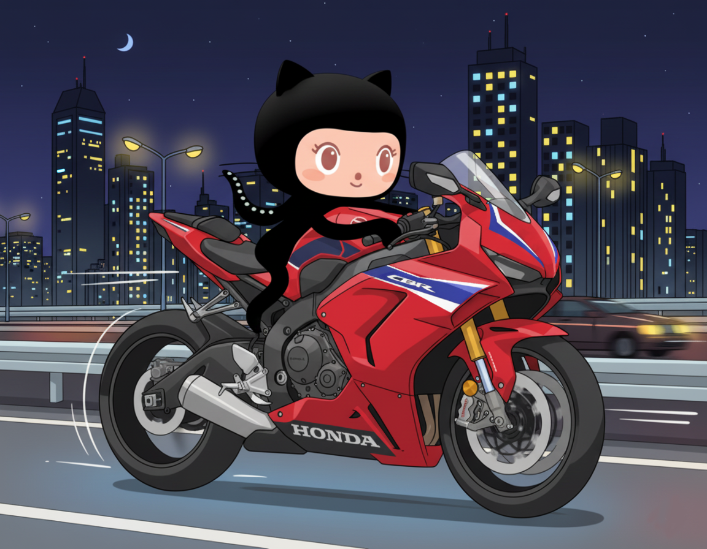
  </div>

</div>


